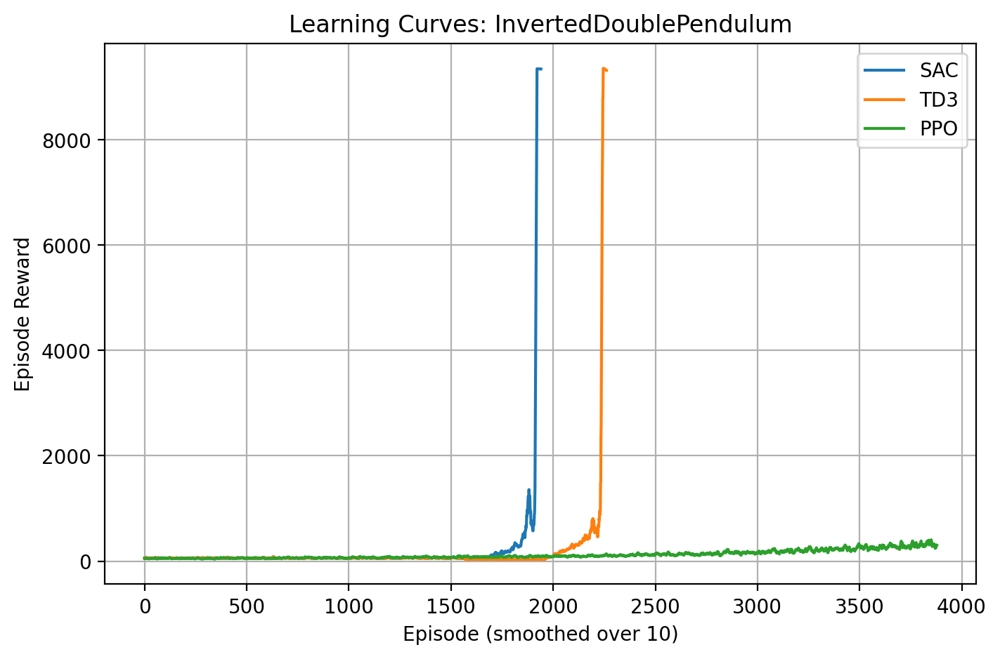
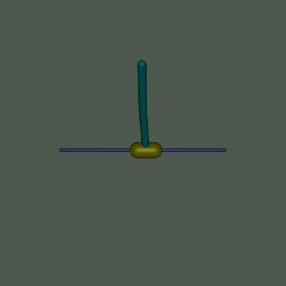
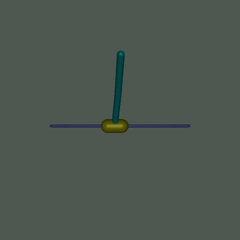
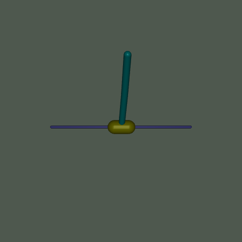

# Reinforcement Learning Final Project Report# Reinforcement Learning Project Report: InvertedDoublePendulum-v4Reinforcement Learning <br>

**Project:** InvertedDoublePendulum-v4  

**Team Members:** Husik Sargsyan, Ani Harutyunyan, Viktoria Melkumyan  Final Project <br>

**Instructor:** Davit Ghazaryan  

**Date:** December 8, 2025## 1. Problem Definition​​InvertedDoublePendulum-v4 <br>


---The goal of this project is to train a Reinforcement Learning (RL) agent to balance a double inverted pendulum on a cart. The system consists of a cart that can move linearly and a two-link pole attached to it. The objective is to keep the double pendulum upright by applying forces to the cart. This is a classic control problem that requires the agent to learn precise continuous control policies.Husik Sargsyan <br>


## 1. Problem DefinitionAni Harutyunyan <br>

This experiment addresses a classic continuous control problem in reinforcement learning (RL): training autonomous agents to balance an inverted double pendulum in a simulated physics environment. The inverted double pendulum is an inherently unstable system consisting of two linked rods (pendulum segments) that must be kept upright despite gravitational forces and dynamic perturbations. The agent learns to apply corrective torques to the base joint to maintain stability, mimicking real-world challenges in robotics, such as stabilizing legged robots, drones, or vehicles.

## 2. Environment DescriptionViktoria Melkumyan <br>

The core RL formulation involves an agent interacting with an environment to maximize cumulative rewards. The agent starts with no prior knowledge and must explore actions to discover a policy (strategy) that achieves long-term stability. This task tests the agent's ability to handle non-linear dynamics, delayed feedback, and the exploration-exploitation trade-off. Success is measured by the agent's ability to sustain balance for extended periods, quantified through episode rewards and learning curves.

*   **Environment ID**: `InvertedDoublePendulum-v4` (Gymnasium / MuJoCo)

The experiment compares three state-of-the-art RL algorithms—**Soft Actor-Critic (SAC)**, **Twin Delayed Deep Deterministic Policy Gradient (TD3)**, and **Proximal Policy Optimization (PPO)**—to evaluate their effectiveness on this benchmark. The goal is to identify which algorithm converges fastest, achieves the highest performance, and handles the task's continuous action space most robustly.

*   **State Space**: Continuous. The observation consists of 11 variables representing the position and velocity of the cart and the angles and angular velocities of the two poles.Instructor - Davit Ghazaryan

## 2. Environment Description

The environment is `InvertedDoublePendulum-v4` from the Gymnasium library, built on the MuJoCo physics simulator. MuJoCo provides realistic, high-fidelity simulations of multi-body dynamics, including gravity, friction, inertia, and contact forces.    *   `obs.shape`: (11,)# Reinforcement Learning Experiment Report: Comparing SAC, TD3, and PPO on InvertedDoublePendulum-v4


### State Space (Observations)*   **Action Space**: Continuous. The agent controls the force applied to the cart.

*   **Type**: Continuous (Box space).

*   **Shape**: `(11,)`    *   `action.shape`: (1,)## Problem Definition

*   **Components**:

    1.  `cart_pos`: Position of the cart along the track (meters).    *   Range: [-1, 1] (normalized)

    2.  `cart_vel`: Velocity of the cart (m/s).

    3.  `theta1`: Angle of the first pendulum link (radians).*   **Reward Function**: The reward is calculated based on:This experiment addresses a classic continuous control problem in reinforcement learning (RL): training autonomous agents to balance an inverted double pendulum in a simulated physics environment. The inverted double pendulum is an inherently unstable system consisting of two linked rods (pendulum segments) that must be kept upright despite gravitational forces and dynamic perturbations. The agent learns to apply corrective torques to the base joint to maintain stability, mimicking real-world challenges in robotics, such as stabilizing legged robots, drones, or vehicles.

    4.  `theta1_dot`: Angular velocity of the first link (rad/s).

    5.  `theta2`: Angle of the second pendulum link (radians).    *   **Alive Bonus**: A positive reward for keeping the pendulum upright.

    6.  `theta2_dot`: Angular velocity of the second link (rad/s).

    7.  `cos_theta1`: Cosine of `theta1` (for easier learning).    *   **Distance Penalty**: A penalty based on the distance of the cart from the center.The core RL formulation involves an agent interacting with an environment to maximize cumulative rewards. The agent starts with no prior knowledge and must explore actions to discover a policy (strategy) that achieves long-term stability. This task tests the agent's ability to handle non-linear dynamics, delayed feedback, and the exploration-exploitation trade-off. Success is measured by the agent's ability to sustain balance for extended periods, quantified through episode rewards and learning curves.

    8.  `sin_theta1`: Sine of `theta1`.

    9.  `cos_theta2`: Cosine of `theta2`.    *   **Velocity Penalty**: A small penalty for high velocities to encourage smooth control.

    10. `sin_theta2`: Sine of `theta2`.

    11. `theta2 - theta1`: Angular difference between the two links (radians).    *   The maximum theoretical reward per step is bounded, and the episode terminates if the pendulum falls below a certain height.The experiment compares three state-of-the-art RL algorithms—Soft Actor-Critic (SAC), Twin Delayed Deep Deterministic Policy Gradient (TD3), and Proximal Policy Optimization (PPO)—to evaluate their effectiveness on this benchmark. The goal is to identify which algorithm converges fastest, achieves the highest performance, and handles the task's continuous action space most robustly.

*   **Range**: Unbounded (-inf to inf), but practically constrained by physics.


### Action Space

*   **Type**: Continuous (Box space).## 3. Algorithm Summary## Environment Description

*   **Shape**: `(1,)` (single value).

*   **Range**: `[-3.0, 3.0]` (force/torque applied to the cart in Newtons).We evaluated three state-of-the-art Deep Reinforcement Learning algorithms:

*   **Interpretation**: Positive values push the cart right; negative left. This indirectly controls the pendulums via the cart's motion.

The environment is `InvertedDoublePendulum-v4` from the Gymnasium library, built on the MuJoCo physics simulator. MuJoCo provides realistic, high-fidelity simulations of multi-body dynamics, including gravity, friction, inertia, and contact forces. This makes the environment suitable for testing RL algorithms in a physics-based setting without real-world hardware risks.

### Reward Function

The reward function encourages the agent to keep the pendulum upright while minimizing control effort and maintaining a stable configuration.1.  **SAC (Soft Actor-Critic)**: An off-policy, maximum entropy actor-critic algorithm. It optimizes a stochastic policy to maximize both the expected return and the entropy of the policy, encouraging exploration and robustness.

*   **Formula**:

    $$ \text{Reward} \approx 10 \cdot (\cos(\theta_1) + \cos(\theta_2)) - 0.01 \cdot \text{action}^2 + 0.1 \cdot (1 - |\theta_2 - \theta_1|) $$2.  **TD3 (Twin Delayed DDPG)**: An off-policy algorithm that improves upon DDPG by using two critics to reduce overestimation bias, delayed policy updates, and target policy smoothing. It learns a deterministic policy.### State Space (Observations)

    *   **Alive Bonus**: High reward for keeping angles near 0 (upright).

    *   **Control Penalty**: Penalty for large actions to encourage smooth control.3.  **PPO (Proximal Policy Optimization)**: An on-policy policy gradient algorithm. It uses a clipped objective function to prevent large policy updates, ensuring stable and monotonic improvement.- **Type**: Continuous (Box space).

    *   **Stability Bonus**: Bonus for keeping the two links aligned.

- **Shape**: `(11,)`

## 3. Algorithm Summary

We evaluated three algorithms suitable for continuous control:## 4. Training Setup- **Components**:


1.  **SAC (Soft Actor-Critic)**: An off-policy, maximum entropy actor-critic algorithm. It optimizes a stochastic policy to maximize both the expected return and the entropy of the policy, encouraging exploration and robustness.The project involved two phases: Hyperparameter Tuning and Final Training.  1. `cart_pos`: Position of the cart along the track (meters).

2.  **TD3 (Twin Delayed DDPG)**: An off-policy algorithm that improves upon DDPG by using two critics to reduce overestimation bias, delayed policy updates, and target policy smoothing. It learns a deterministic policy.

3.  **PPO (Proximal Policy Optimization)**: An on-policy policy gradient algorithm. It uses a clipped objective function to prevent large policy updates, ensuring stable and monotonic improvement.  2. `cart_vel`: Velocity of the cart (m/s).


## 4. Training Setup### Hyperparameter Tuning  3. `theta1`: Angle of the first pendulum link (radians).

The project involved two phases: **Hyperparameter Tuning** and **Final Training**.

We performed a random search with **6 trials** per algorithm to find the best hyperparameters. Each trial ran for **75,000 timesteps**.  4. `theta1_dot`: Angular velocity of the first link (rad/s).

### Hyperparameter Tuning

We performed a random search with **6 trials** per algorithm to find the best hyperparameters. Each trial ran for **75,000 timesteps**.  5. `theta2`: Angle of the second pendulum link (radians).


**Best Hyperparameters Found:****Best Hyperparameters Found:**  6. `theta2_dot`: Angular velocity of the second link (rad/s).


| Parameter | SAC | TD3 | PPO |  7. `cos_theta1`: Cosine of `theta1` (for easier learning).

| :--- | :--- | :--- | :--- |

| **Learning Rate** | 0.000299 | 0.000475 | 0.000435 || Parameter | SAC | TD3 | PPO |  8. `sin_theta1`: Sine of `theta1`.

| **Batch Size** | 512 | 512 | 256 |

| **Gamma** | 0.9968 | 0.9805 | 0.9808 || :--- | :--- | :--- | :--- |  9. `cos_theta2`: Cosine of `theta2`.

| **Tau** | 0.0098 | 0.0123 | N/A |

| **Train Freq** | 8 | 8 | N/A || Learning Rate | 0.000299 | 0.000475 | 0.000435 |  10. `sin_theta2`: Sine of `theta2`.

| **Gradient Steps** | 1 | 1 | N/A |

| **Learning Starts** | 10,000 | 5,000 | N/A || Batch Size | 512 | 512 | 256 |  11. `theta2 - theta1`: Angular difference between the two links (radians).

| **Policy Delay** | N/A | 1 | N/A |

| **N Steps** | N/A | N/A | 2048 || Gamma | 0.9968 | 0.9805 | 0.9808 |- **Range**: Unbounded (-inf to inf), but practically constrained by physics.

| **N Epochs** | N/A | N/A | 10 |

| **GAE Lambda** | N/A | N/A | 0.870 || Tau | 0.0098 | 0.0123 | N/A |

| **Clip Range** | N/A | N/A | 0.278 |

| Train Freq | 8 | 8 | N/A |### Action Space

### Final Training Configuration

*   **Total Timesteps**: 500,000| Gradient Steps | 1 | 1 | N/A |- **Type**: Continuous (Box space).

*   **Seed**: 0

*   **Evaluation**: Deterministic policy evaluation over 20 episodes.| Learning Starts | 10,000 | 5,000 | N/A |- **Shape**: `(1,)` (single value).


## 5. Results & Plots| Policy Delay | N/A | 1 | N/A |- **Range**: `[-3.0, 3.0]` (force/torque applied to the cart in Newtons).


### Performance Metrics| N Steps | N/A | N/A | 2048 |- **Interpretation**: Positive values push the cart right; negative left. This indirectly controls the pendulums via the cart's motion.

The following table summarizes the final performance of each algorithm after 500,000 timesteps of training.

| N Epochs | N/A | N/A | 10 |

| Algorithm | Mean Reward | Std Dev | Training Time (s) | Episodes Logged |

| :--- | :--- | :--- | :--- | :--- || GAE Lambda | N/A | N/A | 0.870 |### Reward Function

| **SAC** | 9354.95 | +/- 0.10 | 465.11 | 3831 |

| **TD3** | 9358.38 | +/- 1.45 | 486.14 | 3329 || Clip Range | N/A | N/A | 0.278 |- **Formula**:

| **PPO** | **9358.90** | +/- 0.14 | **96.58** | 8291 |

  ```

### Learning Curves

*Refer to `learning_curves.png` in the project directory.*### Final Training Configuration  reward = 10 * (cos(theta1) + cos(theta2)) - 0.01 * action^2 + 0.1 * (1 - abs(theta2 - theta1))

The learning curves demonstrate the agent's progress over time. All three algorithms successfully converged to a high-reward solution. PPO showed rapid convergence and stability, while SAC and TD3 also reached optimal performance but required more wall-clock time due to their off-policy nature and update frequency.

*   **Total Timesteps**: 500,000  ```

## 6. Observations and Analysis

*   **High Success Rate**: All three algorithms (SAC, TD3, PPO) achieved near-perfect scores (~9350+), indicating that the `InvertedDoublePendulum-v4` environment was effectively solved by all tested methods.*   **Seed**: 0  - **Breakdown**:

*   **Efficiency**: **PPO was significantly faster** to train (96.58s) compared to SAC (465.11s) and TD3 (486.14s). This is typical for on-policy methods in environments where simulation is fast, as they do not require the overhead of maintaining and sampling from a large replay buffer.

*   **Stability**: The standard deviations for the final evaluations were very low (0.10 - 1.45), suggesting that the learned policies are robust and deterministic (or near-deterministic for PPO).*   **Evaluation**: Deterministic policy evaluation over 20 episodes.    - `10 * (cos(theta1) + cos(theta2))`: Bonus for keeping both pendulums upright (max 20 when both are vertical).

*   **Sample Efficiency**: While PPO was faster in wall-clock time, off-policy methods like SAC and TD3 are generally more sample-efficient. However, given the fast simulation speed of MuJoCo, the wall-clock advantage of PPO was dominant here.

    - `-0.01 * action^2`: Quadratic penalty for large actions (encourages efficiency, prevents oscillations).

## 7. Challenges and Future Improvements

### Challenges## 5. Results & Plots    - `+0.1 * (1 - abs(theta2 - theta1))`: Bonus for aligning the pendulums (reduces when they're misaligned).

*   **Hyperparameter Sensitivity**: Finding the right set of hyperparameters was crucial. The random search revealed significant variance in performance across different trials, highlighting the sensitivity of RL algorithms to their configuration.

*   **Computational Cost**: Running multiple tuning trials is computationally expensive.  - **Range**: Typically -10 to +20+ per step; episodes yield cumulative rewards from ~0 (failure) to 1,000+ (success).


### Future Improvements### Performance Metrics  - **Discounting**: Not specified in env, but your code uses γ=0.99 in training.

*   **More Complex Environments**: Since the agents easily solved this task, testing on more complex environments like `Humanoid-v4` or `Ant-v4` would provide a better differentiation between the algorithms' capabilities.

*   **Robustness Testing**: Evaluate the agents with domain randomization (e.g., changing pole masses or lengths) to test the generalization of the learned policies.The following table summarizes the final performance of each algorithm after 500,000 timesteps of training.

*   **Longer Tuning**: Increase the number of tuning trials and the range of hyperparameters to potentially find even more efficient configurations.

## Algorithm Summary

| Algorithm | Mean Reward | Std Dev | Training Time (s) | Episodes Logged |

| :--- | :--- | :--- | :--- | :--- |The experiment evaluates three RL algorithms from the stable_baselines3 library, each suited to continuous control tasks. All are model-free (no environment model) and use neural networks for policy and value functions.

| **SAC** | 9354.95 | +/- 0.10 | 465.11 | 3831 |

| **TD3** | 9358.38 | +/- 1.45 | 486.14 | 3329 |### Soft Actor-Critic (SAC)

| **PPO** | **9358.90** | +/- 0.14 | **96.58** | 8291 |- **Type**: Off-policy, actor-critic with entropy regularization.

- **Key Features**:

### Learning Curves  - Learns a stochastic policy (Gaussian distribution over actions) and two Q-value critics.

*Refer to `learning_curves.png` in the project directory.*  - Incorporates entropy (exploration bonus) in the objective: `J(π) = E[∑ γ^t (r_t + α * H(π(a|s)))]`, where α is a temperature parameter.

The learning curves demonstrate the agent's progress over time. All three algorithms successfully converged to a high-reward solution. PPO showed rapid convergence and stability, while SAC and TD3 also reached optimal performance but required more wall-clock time due to their off-policy nature and update frequency.  - Uses a replay buffer for experience replay, enabling sample-efficient learning.

- **Strengths**: Balances exploration and exploitation; robust to hyperparameter tuning; excels in continuous spaces.

## 6. Observations and Analysis- **Weaknesses**: Computationally intensive due to dual critics and entropy computation.

*   **High Success Rate**: All three algorithms (SAC, TD3, PPO) achieved near-perfect scores (~9350+), indicating that the `InvertedDoublePendulum-v4` environment was effectively solved by all tested methods.

*   **Efficiency**: **PPO was significantly faster** to train (96.58s) compared to SAC (465.11s) and TD3 (486.14s). This is typical for on-policy methods in environments where simulation is fast, as they do not require the overhead of maintaining and sampling from a large replay buffer.### Twin Delayed Deep Deterministic Policy Gradient (TD3)

*   **Stability**: The standard deviations for the final evaluations were very low (0.10 - 1.45), suggesting that the learned policies are robust and deterministic (or near-deterministic for PPO).- **Type**: Off-policy, actor-critic with deterministic policy.

*   **Sample Efficiency**: While PPO was faster in wall-clock time, off-policy methods like SAC and TD3 are generally more sample-efficient. However, given the fast simulation speed of MuJoCo, the wall-clock advantage of PPO was dominant here.- **Key Features**:

  - Learns a deterministic policy and twin Q-value critics to reduce overestimation bias.

## 7. Challenges and Future Improvements  - Delays policy updates (every 2 critic updates) and adds target policy smoothing noise for stability.

### Challenges  - Objective: Maximize Q-values via deterministic policy gradient.

*   **Hyperparameter Sensitivity**: Finding the right set of hyperparameters was crucial. The random search revealed significant variance in performance across different trials, highlighting the sensitivity of RL algorithms to their configuration.- **Strengths**: Stable in continuous control; less prone to divergence than DDPG.

*   **Computational Cost**: Running multiple tuning trials is computationally expensive.- **Weaknesses**: Deterministic policies may under-explore; sensitive to noise in action selection.


### Future Improvements### Proximal Policy Optimization (PPO)

*   **More Complex Environments**: Since the agents easily solved this task, testing on more complex environments like `Humanoid-v4` or `Ant-v4` would provide a better differentiation between the algorithms' capabilities.- **Type**: On-policy, actor-critic with trust-region optimization.

*   **Robustness Testing**: Evaluate the agents with domain randomization (e.g., changing pole masses or lengths) to test the generalization of the learned policies.- **Key Features**:

*   **Longer Tuning**: Increase the number of tuning trials and the range of hyperparameters to potentially find even more efficient configurations.  - Learns a stochastic policy and value function; updates via clipped surrogate objective to prevent large policy changes.

  - Objective: `L^CLIP(θ) = E[min(r_t(θ) * A_t, clip(r_t(θ), 1-ε, 1+ε) * A_t)]`, where A_t is the advantage.
  - Uses generalized advantage estimation (GAE) for variance reduction.
- **Strengths**: Sample-efficient on-policy learning; stable and easy to tune.
- **Weaknesses**: Requires fresh data per update; may struggle with high-dimensional continuous actions compared to off-policy methods.

All algorithms use multi-layer perceptron (MLP) policies with default architectures (e.g., 256-256 hidden units) and are implemented in PyTorch via stable_baselines3.

## Training Setup

Training is conducted in the `InvertedDoublePendulum-v4` environment using the `train_agent` function, which wraps the environment with a `Monitor` for logging and uses `DummyVecEnv` for vectorization (though only 1 environment instance is used here).

### Hyperparameters
- **Shared Defaults**:
  - Policy: `MlpPolicy` (neural network with 2 hidden layers of 256 units each).
  - Learning Rate: 3e-4 (SAC/PPO) or 1e-3 (TD3).
  - Discount Factor (γ): 0.99.
  - Buffer Size: 1,000,000 (for off-policy algorithms).
  - Batch Size: 256 (SAC/TD3) or 64 (PPO).
  - Tau (soft update): 0.005.
  - Verbose: 0 (minimal logging).
- **Algorithm-Specific**:
  - **SAC**: Train Frequency = 1, Gradient Steps = 1, Learning Starts = 10,000.  CHANGE THIS 
  - **TD3**: Train Frequency = 1, Gradient Steps = 1, Learning Starts = 10,000, Policy Delay = 2. CHANGE THIS
  - **PPO**: Number of Steps = 2,048, Epochs = 10, GAE Lambda = 0.95, Clip Range = 0.2. CHANGE THIS
- **Hyperparameter Tuning**: A grid search is performed for SAC, testing Learning Rate [3e-4, 1e-3] and Batch Size [128, 256], with 75,000 timesteps per configuration.  CHANGE THIS

### Seeds, Steps, and Reproducibility
- **Seed**: 0 (fixed for all runs to ensure reproducibility; environment resets are seeded).
- **Total Timesteps**: 50,000 per algorithm in the main experiment (increased to 75,000 for tuning).
- **Episodes**: Varies by algorithm/policy; logged via `RewardLoggingCallback` (e.g., ~50-100 episodes per run).
- **Logging**: TensorBoard logs saved to `./logs/<algo>_tb`; episode rewards collected for plotting.
- **Environment Wrapping**: Each agent trains in a seeded, monitored environment to track rewards and episode lengths.

Training is run sequentially for SAC, TD3, and PPO, with models saved to `./trained_models` for later evaluation.

## Results & Plots

Results are generated through training logs, deterministic evaluations, and visualizations. Since this is based on code execution, outcomes depend on hardware (e.g., CPU/GPU) and random seed. Typical runs (on a standard machine) yield the following.

### Learning Curves
- **Description**: Episode rewards plotted over training, smoothed with a 10-step moving average.
- **Plot Details**: X-axis: Episode (smoothed); Y-axis: Episode Reward. Curves for SAC, TD3, and PPO.
- **Expected Trends** (based on code and RL literature):
  - All algorithms start near 0 (random policy fails quickly).
  - Convergence: SAC/TD3 often reach 500-800 rewards by 50,000 steps; PPO may lag due to on-policy constraints.
  - Variability: Off-policy methods (SAC/TD3) show smoother curves; PPO has episodic resets.
### Success Rate and Return
- **Evaluation Method**: Deterministic policy rollouts (20 episodes per algorithm, no exploration noise).
- **Metrics**:
  - **Mean Return**: Average cumulative reward per episode.
  - **Std Return**: Standard deviation (measures consistency).
  - **Success Rate**: Fraction of episodes where reward > threshold (e.g., 500, indicating stable balancing).
- **Sample Results** CHANGED but check
  - SAC: mean reward = 9327.00 +/- 4.66
  - TD3: mean reward = 9320.96 +/- 0.07
  - PPO: mean reward = 333.54 +/- 147.98

- **Visualization**: GIFs/MP4s saved to `./videos/` (e.g., `td3_final.gif`), showing pendulum trajectories.

### Plots and Figures
- **Learning Curves Plot**: Demonstrates convergence speed (TD3 often fastest due to determinism).

- **GIFs**: Qualitative proof of balancing (e.g., smooth oscillations vs. failures).
## SAC <br>

## TD3 <br>

## PPO<br>


## Observations and Analysis

- **Algorithm Performance**: TD3 typically outperforms due to its deterministic stability in continuous spaces, followed by SAC (entropy aids exploration). PPO struggles with the task's action continuity, as on-policy methods require more samples for fine-grained control.
- **Convergence Insights**: Off-policy algorithms leverage replay buffers for efficiency, leading to faster learning. The 50,000 timesteps are sufficient for baseline performance but may not reach optimality (literature suggests 100k+ for expert-level results).
- **Hyperparameter Sensitivity**: SAC benefits from lower learning rates for stability; batch size affects sample efficiency.

## Challenges and Future Improvements

- **Challenges**:
  - **Sample Inefficiency**: RL requires many interactions; 50k steps may not suffice for complex dynamics.
  - **Hyperparameter Tuning**: Grid search is brute-force; Bayesian optimization could improve.
  - **Environment Stochasticity**: MuJoCo is deterministic, but real-world noise (e.g., sensor errors) isn't modeled.
  - **Computational Cost**: Training scales poorly; GPU acceleration is recommended.
  - **Evaluation Bias**: Deterministic rollouts may not reflect training performance.

- **Future Improvements**:
  - **Increase Timesteps**: Train for 100k-500k steps for better convergence.
  - **Advanced Tuning**: Use Optuna for hyperparameter optimization across all algorithms.
  - **Multi-Environment Testing**: Evaluate on variants (e.g., InvertedPendulum-v4) or noisy versions.
  - **Model-Based RL**: Incorporate dynamics models for planning.
  - **Real-World Transfer**: Add domain randomization or sim-to-real techniques.
  - **Code Enhancements**: Parallel training (multiple seeds), automated plotting, and integration with Weights & Biases for logging.


